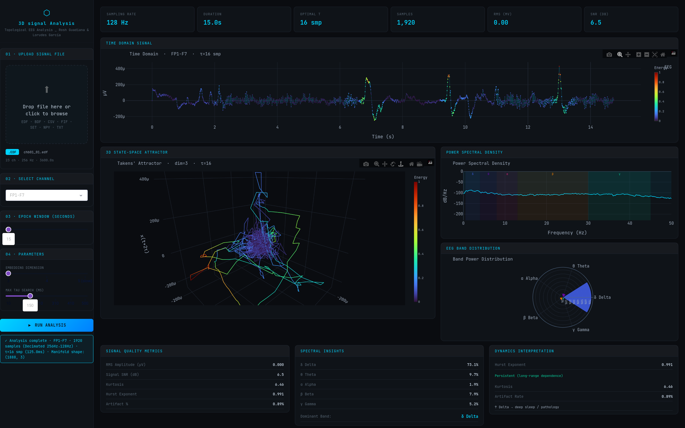

# Biomedical Signal Processing & Topological State-Space Analysis Engine



## Overview
This repository contains the source code for the **Takens' Attractor Dashboard**, an interactive high-performance computational tool designed for the topological reconstruction and nonlinear dynamic analysis of univariate clinical time-series data (EEG, ECG, EMG). 

The system leverages advanced digital signal processing (DSP) and differential topology to map scalar physiological recordings into multi-dimensional phase spaces. It is engineered with a strict focus on zero-copy vectorization, robust signal preprocessing, and WebGL-accelerated interactive visualizations to support real-time clinical decision-making and neurophysiological research.

---

## 1. Mathematical Foundations

### 1.1 Phase-Space Reconstruction (Takens' Delay Embedding)
The core analytical engine relies on Takens' Embedding Theorem. A discrete, scalar physiological signal $x_n = x(n\Delta t)$ represents a one-dimensional projection of a high-dimensional, nonlinear dynamical system (e.g., the synchronized postsynaptic potentials of cortical neuronal populations). 

To recover the topological properties of the original, unobserved state space, we construct a sequence of $m$-dimensional delay vectors $\mathbf{X}_n \in \mathbb{R}^m$:

$$\mathbf{X}_n = \left[ x_n, x_{n+\tau}, x_{n+2\tau}, \dots, x_{n+(m-1)\tau} \right]$$

Where:
* $m$ is the **embedding dimension**, which must satisfy $m \ge 2d + 1$ (where $d$ is the box-counting dimension of the original attractor) to ensure the mapping is a diffeomorphism.
* $\tau$ is the **embedding delay**, optimized via the first minimum of the auto-mutual information function or the zero-crossing of the autocorrelation function to ensure orthogonal coordinate components.

### 1.2 Spectral Density Estimation
Frequency-domain characteristics are computed using Welch’s method to reduce variance in the periodogram. The Power Spectral Density (PSD) is estimated over overlapping segments (Hanning windowed) of length $L$:

$$P_{xx}(f) = \frac{1}{K} \sum_{k=1}^K \left| \sum_{n=0}^{L-1} x_k(n) w(n) e^{-j2\pi fn/f_s} \right|^2$$

---

## 2. Clinical Translation

The mathematical mapping of a 1D time-series into a 3D manifold ($m=3$) provides immediate, visually interpretable heuristic markers of neurophysiological state transitions:

* **Epileptogenesis & Ictal States:** A healthy, resting-state EEG (e.g., dominant alpha rhythm) exhibits a stable, quasi-periodic limit cycle or strange attractor with high dimensionality. During an epileptic seizure, the hyper-synchronous neuronal firing causes the attractor topology to collapse into a highly structured, low-dimensional manifold (often resembling a tightly wound vortex). 
* **Sleep Staging & Anesthetic Depth:** Deepening anesthesia or progression into NREM sleep (dominated by delta/theta activity) results in increased trajectory excursion radii and reduced orbital complexity. The shape and volume of the phase-space manifold serve as quantitative proxies for the degree of cortical decoupling.

By visualizing these dynamics continuously, the cognitive load on the clinician is reduced; structural changes in the manifold mathematically precede and visually out-pronounce subtle temporal waveform alterations.

---

## 3. Computational Architecture & Efficiency

To process high-density (e.g., >500 Hz) physiological arrays dynamically in the browser, the architecture heavily relies on memory-efficient array operations:

* **$O(1)$ Memory Embedding:** Delay coordinate embedding is strictly executed via `numpy.lib.stride_tricks.as_strided`. Instead of copying the array $m$ times, we manipulate the memory strides to yield a windowed view of the data. This guarantees zero-allocation latency during dynamic $\tau$ updates.
* **Robust Signal Conditioning:** Real-world clinical recordings contain baseline wander and power-line interference. The engine applies an infinite impulse response (IIR) Butterworth bandpass pipeline. To prevent nonlinear phase distortion—which destroys the topology of the attractor—filtering is applied bidirectionally (`scipy.signal.filtfilt`):
    $$H_{eff}(e^{j\omega}) = H(e^{j\omega})H^*(e^{j\omega}) = |H(e^{j\omega})|^2$$
    This ensures precisely zero-phase shift across all frequency bands.

---

## 4. Visual Interpretability (HCI)

The user interface is constructed using `Dash` and `Plotly` WebGL engines. The 3D phase-space trajectory is not merely a scatter plot; it is a continuous curve encoded with a temporal color gradient. 

* **Color Mapping:** The phase vector is colored by time sequence using the continuous `Viridis` or `Plasma` color scales. This allows the clinician to track the temporal evolution, velocity, and directionality of the state trajectory on the manifold.
* **Synchronized Informatics:** The dashboard tightly couples the time-domain waveform, the frequency-domain PSD, and the topological manifold, updating all spaces simultaneously upon adjusting embedding parameters ($\tau$, downsampling rate, or frequency bands).

---

## 5. Setup & Execution

### Supported Formats
* `EDF` / `BDF` (European Data Format - Clinical Standard)
* `FIF` (MNE Neuromag)
* `SET` (EEGLAB)
* `CSV` / `TXT` / `NPY`

### Environment Requirements
Requires Python 3.10+.

```bash
# 1. Clone the repository
git clone https://github.com/your-org/takens-attractor-dashboard.git
cd takens-attractor-dashboard

# 2. Install dependencies
pip install numpy scipy pandas pywt mne dash dash-bootstrap-components plotly dash-uploader

# 3. Launch the engine
python atractor.py
```
Navigate to `http://127.0.0.1:8050` in any modern WebGL-enabled browser to access the graphical interface.

---

## 6. References

1. Takens, F. (1981). *Detecting strange attractors in turbulence*. Dynamical Systems and Turbulence, Warwick 1980.
2. Cohen, M. X. (2014). *Analyzing Neural Time Series Data: Theory and Practice*. The MIT Press.
3. Smith, L. (2007). *Chaos: A Very Short Introduction*. Oxford University Press.
4. Munkres, J. R. (2014). *Topology*. Pearson.
